# Database Schema Diagram

This diagram reflects the current Django model schema in the repository as of `2026-05-07`.

Notes:
- Standard audit columns from `AuditFieldsModel` and `CreatedAuditModel` are omitted from most boxes for readability.
- Many lifecycle, role, and classification fields are foreign keys to `REF_VALUE`.
- This is a logical ER diagram for the application schema, not a physical index-by-index database dump.

```mermaid
erDiagram
    REF_DOMAIN {
        bigint id PK
        string domain_code
        string name
        bool active_flag
    }

    REF_VALUE {
        bigint id PK
        bigint domain_id FK
        string value_code
        string value_label
        int sort_order
        bool active_flag
    }

    OFFICE {
        bigint id PK
        string office_name
        bigint status_id FK
    }

    BUSINESS_UNIT {
        bigint id PK
        string bu_code
        string name
        bigint office_id FK
        bigint status_id FK
    }

    YEARLY_CALENDAR {
        bigint id PK
        bigint business_unit_id FK
        bigint office_id FK
        int calendar_year
        string calendar_name
        bigint status_id FK
    }

    EMPLOYEE {
        bigint id PK
        string employee_code
        string full_name
        string email
        string canonical_email
        bigint office_id FK
        bigint status_id FK
        bigint primary_business_unit_id FK
        bigint manager_employee_id FK
        bigint assigned_calendar_id FK
    }

    EMPLOYEE_BUSINESS_UNIT {
        bigint id PK
        bigint employee_id FK
        bigint business_unit_id FK
        bool is_primary_flag
        bigint status_id FK
        date valid_from
        date valid_to
    }

    EMPLOYEE_ROLE {
        bigint id PK
        bigint employee_id FK
        bigint role_id FK
        bigint business_unit_id FK
        date valid_from
        date valid_to
        bigint status_id FK
    }

    CALENDAR_PERIOD_RULE {
        bigint id PK
        bigint yearly_calendar_id FK
        bigint office_id FK
        date effective_from
        date effective_to
        decimal monday_max_hours
        decimal friday_max_hours
        bigint status_id FK
    }

    CALENDAR_SPECIAL_DAY {
        bigint id PK
        bigint yearly_calendar_id FK
        date special_date
        bigint day_type_id FK
        bigint default_general_charge_code_id FK
        bigint status_id FK
    }

    CLIENT {
        bigint id PK
        bigint office_id FK
        bigint parent_client_id FK
        string client_code
        string name
        bigint status_id FK
    }

    INTERNAL_CATEGORY {
        bigint id PK
        bigint business_unit_id FK
        bigint office_id FK
        string category_code
        string name
        bigint status_id FK
    }

    COST_CENTER {
        bigint id PK
        bigint office_id FK
        string cost_center_code
        string name
        bigint status_id FK
    }

    GENERAL_CHARGE_CODE {
        bigint id PK
        bigint business_unit_id FK
        bigint office_id FK
        string code
        string name
        bigint charge_type_id FK
        bool billable_flag
        bool common_code_flag
        bool requires_approval_flag
        date valid_from
        date valid_to
        bigint status_id FK
    }

    PROJECT {
        bigint id PK
        bigint business_unit_id FK
        bigint office_id FK
        string project_code
        string name
        bigint project_owner_employee_id FK
        bigint project_manager_employee_id FK
        bigint client_id FK
        bigint internal_category_id FK
        bigint cost_center_id FK
        date start_date
        date end_date
        date close_date
        bool billable_flag
        bigint status_id FK
    }

    PROJECT_ASSIGNMENT {
        bigint id PK
        bigint project_id FK
        bigint employee_id FK
        date assignment_start_date
        date assignment_end_date
        bigint status_id FK
    }

    OFFICE_CONFIGURATION {
        bigint id PK
        bigint office_id FK
        bigint approval_mode_id FK
        bool allow_employee_withdraw_flag
        date timesheet_cutoff_date
        bool count_non_billable_in_daily_limit_flag
        int archive_after_years
        bool enable_timer_flag
        bool enable_leave_integration_flag
        bool enable_copy_previous_week_flag
    }

    REMINDER_RULE {
        bigint id PK
        bigint business_unit_id FK
        bigint reminder_type_id FK
        string rule_name
        bool active_flag
        string schedule_expression
    }

    CUSTOM_ATTRIBUTE_DEFINITION {
        bigint id PK
        bigint business_unit_id FK
        string attribute_code
        string name
        bigint data_type_id FK
        bool active_flag
    }

    CUSTOM_ATTRIBUTE_RULE {
        bigint id PK
        bigint custom_attribute_definition_id FK
        bigint business_unit_id FK
        bigint project_id FK
        bigint general_charge_code_id FK
        bool mandatory_flag
        date valid_from
        date valid_to
        bool active_flag
    }

    WEEKLY_TIMESHEET {
        bigint id PK
        bigint employee_id FK
        bigint business_unit_id FK
        date week_start_date
        date week_end_date
        bigint status_id FK
        int current_submission_no
        datetime submission_datetime
        datetime final_approval_datetime
    }

    TIMESHEET_LINE {
        bigint id PK
        bigint weekly_timesheet_id FK
        date work_date
        bigint project_id FK
        bigint general_charge_code_id FK
        bigint activity_code_id FK
        decimal hours
        bool billable_flag
        bigint approval_state_id FK
    }

    TIMESHEET_SUBMISSION_CYCLE {
        bigint id PK
        bigint weekly_timesheet_id FK
        int submission_no
        bigint submitted_by_employee_id FK
        datetime submitted_at
        bigint cycle_status_id FK
        datetime completed_at
        bigint outcome_status_id FK
    }

    APPROVAL_ITEM {
        bigint id PK
        bigint submission_cycle_id FK
        bigint scope_type_id FK
        bigint approver_employee_id FK
        bigint project_id FK
        bigint timesheet_line_id FK
        bigint general_charge_code_id FK
        bigint status_id FK
    }

    APPROVAL_ACTION {
        bigint id PK
        bigint approval_item_id FK
        bigint action_type_id FK
        bigint acted_by_employee_id FK
        datetime action_timestamp
    }

    TIMESHEET_LINE_ATTRIBUTE_VALUE {
        bigint id PK
        bigint timesheet_line_id FK
        bigint custom_attribute_definition_id FK
        string value_text
        decimal value_number
        date value_date
        bool value_boolean
        bigint ref_value_id FK
    }

    AUDIT_LOG {
        bigint id PK
        datetime event_timestamp
        bigint actor_employee_id FK
        string actor_email
        string entity_name
        bigint entity_id
        bigint action_type_id FK
        bigint business_unit_id FK
        datetime created_at
    }

    INTEGRATION_JOB {
        bigint id PK
        bigint business_unit_id FK
        string interface_code
        string direction
        bigint status_id FK
        datetime started_at
        datetime finished_at
        bigint requested_by_employee_id FK
    }

    INTEGRATION_JOB_ERROR {
        bigint id PK
        bigint integration_job_id FK
        int row_no
        string entity_name
        string external_key
        string error_code
    }

    REF_DOMAIN ||--o{ REF_VALUE : contains
    REF_VALUE ||--o{ OFFICE : status
    REF_VALUE ||--o{ BUSINESS_UNIT : status
    REF_VALUE ||--o{ YEARLY_CALENDAR : status
    REF_VALUE ||--o{ EMPLOYEE : status
    REF_VALUE ||--o{ EMPLOYEE_BUSINESS_UNIT : status
    REF_VALUE ||--o{ EMPLOYEE_ROLE : role_or_status
    REF_VALUE ||--o{ CALENDAR_PERIOD_RULE : status
    REF_VALUE ||--o{ CALENDAR_SPECIAL_DAY : type_or_status
    REF_VALUE ||--o{ CLIENT : status
    REF_VALUE ||--o{ INTERNAL_CATEGORY : status
    REF_VALUE ||--o{ COST_CENTER : status
    REF_VALUE ||--o{ GENERAL_CHARGE_CODE : charge_type_or_status
    REF_VALUE ||--o{ PROJECT : status
    REF_VALUE ||--o{ PROJECT_ASSIGNMENT : status
    REF_VALUE ||--o{ OFFICE_CONFIGURATION : approval_mode
    REF_VALUE ||--o{ REMINDER_RULE : reminder_type
    REF_VALUE ||--o{ CUSTOM_ATTRIBUTE_DEFINITION : data_type
    REF_VALUE ||--o{ WEEKLY_TIMESHEET : status
    REF_VALUE ||--o{ TIMESHEET_LINE : activity_or_approval_state
    REF_VALUE ||--o{ TIMESHEET_SUBMISSION_CYCLE : cycle_or_outcome_status
    REF_VALUE ||--o{ APPROVAL_ITEM : scope_or_status
    REF_VALUE ||--o{ APPROVAL_ACTION : action_type
    REF_VALUE ||--o{ TIMESHEET_LINE_ATTRIBUTE_VALUE : ref_value
    REF_VALUE ||--o{ AUDIT_LOG : action_type
    REF_VALUE ||--o{ INTEGRATION_JOB : status

    OFFICE ||--|| OFFICE_CONFIGURATION : configures
    OFFICE ||--o{ BUSINESS_UNIT : groups
    OFFICE ||--o{ YEARLY_CALENDAR : owns
    OFFICE ||--o{ EMPLOYEE : belongs_to
    OFFICE ||--o{ CALENDAR_PERIOD_RULE : governs
    OFFICE ||--o{ CLIENT : owns
    OFFICE ||--o{ INTERNAL_CATEGORY : owns
    OFFICE ||--o{ COST_CENTER : owns
    OFFICE ||--o{ GENERAL_CHARGE_CODE : owns
    OFFICE ||--o{ PROJECT : owns

    BUSINESS_UNIT ||--o{ YEARLY_CALENDAR : owns
    BUSINESS_UNIT ||--o{ EMPLOYEE : primary_for
    BUSINESS_UNIT ||--o{ EMPLOYEE_BUSINESS_UNIT : scopes
    BUSINESS_UNIT ||--o{ EMPLOYEE_ROLE : scopes
    BUSINESS_UNIT ||--o{ INTERNAL_CATEGORY : owns
    BUSINESS_UNIT ||--o{ GENERAL_CHARGE_CODE : owns
    BUSINESS_UNIT ||--o{ PROJECT : owns
    BUSINESS_UNIT ||--o{ REMINDER_RULE : owns
    BUSINESS_UNIT ||--o{ CUSTOM_ATTRIBUTE_DEFINITION : owns
    BUSINESS_UNIT ||--o{ CUSTOM_ATTRIBUTE_RULE : owns
    BUSINESS_UNIT ||--o{ WEEKLY_TIMESHEET : books
    BUSINESS_UNIT ||--o{ AUDIT_LOG : contexts
    BUSINESS_UNIT ||--o{ INTEGRATION_JOB : runs

    YEARLY_CALENDAR ||--o{ EMPLOYEE : assigned_to
    YEARLY_CALENDAR ||--o{ CALENDAR_PERIOD_RULE : has
    YEARLY_CALENDAR ||--o{ CALENDAR_SPECIAL_DAY : has

    EMPLOYEE ||--o{ EMPLOYEE_BUSINESS_UNIT : assigned_to
    EMPLOYEE ||--o{ EMPLOYEE_ROLE : has
    EMPLOYEE ||--o{ EMPLOYEE : manages
    EMPLOYEE ||--o{ PROJECT : owns_or_manages
    EMPLOYEE ||--o{ PROJECT_ASSIGNMENT : assigned
    EMPLOYEE ||--o{ WEEKLY_TIMESHEET : owns
    EMPLOYEE ||--o{ TIMESHEET_SUBMISSION_CYCLE : submits
    EMPLOYEE ||--o{ APPROVAL_ITEM : approves
    EMPLOYEE ||--o{ APPROVAL_ACTION : acts
    EMPLOYEE ||--o{ AUDIT_LOG : actor
    EMPLOYEE ||--o{ INTEGRATION_JOB : requests

    CLIENT ||--o{ CLIENT : parent_of
    CLIENT ||--o{ PROJECT : bills
    INTERNAL_CATEGORY ||--o{ PROJECT : classifies
    COST_CENTER ||--o{ PROJECT : funds
    GENERAL_CHARGE_CODE ||--o{ CALENDAR_SPECIAL_DAY : defaults
    GENERAL_CHARGE_CODE ||--o{ CUSTOM_ATTRIBUTE_RULE : targets
    GENERAL_CHARGE_CODE ||--o{ TIMESHEET_LINE : charged_on
    GENERAL_CHARGE_CODE ||--o{ APPROVAL_ITEM : approves

    PROJECT ||--o{ PROJECT_ASSIGNMENT : staffs
    PROJECT ||--o{ CUSTOM_ATTRIBUTE_RULE : governs
    PROJECT ||--o{ TIMESHEET_LINE : charged_on
    PROJECT ||--o{ APPROVAL_ITEM : approves

    WEEKLY_TIMESHEET ||--o{ TIMESHEET_LINE : contains
    WEEKLY_TIMESHEET ||--o{ TIMESHEET_SUBMISSION_CYCLE : submits
    TIMESHEET_LINE ||--o{ APPROVAL_ITEM : reviewed_by
    TIMESHEET_LINE ||--o{ TIMESHEET_LINE_ATTRIBUTE_VALUE : decorates
    TIMESHEET_SUBMISSION_CYCLE ||--o{ APPROVAL_ITEM : creates
    APPROVAL_ITEM ||--o{ APPROVAL_ACTION : records
    CUSTOM_ATTRIBUTE_DEFINITION ||--o{ CUSTOM_ATTRIBUTE_RULE : constrains
    CUSTOM_ATTRIBUTE_DEFINITION ||--o{ TIMESHEET_LINE_ATTRIBUTE_VALUE : defines
    INTEGRATION_JOB ||--o{ INTEGRATION_JOB_ERROR : reports
```

## Main Modules

- `reference_data`: shared domains and values used for roles, statuses, action types, day types, and approval modes.
- `master_data`: office, business units, employees, calendars, clients, classifications, charge codes, projects, assignments, and configurable rules.
- `timesheets`: weekly timesheets, lines, submission cycles, approval items, approval actions, and custom attribute values.
- `audit`: application audit trail.
- `integrations`: tracked import/export jobs and row-level errors.

## Office-Specific Highlights

- `OFFICE` is a first-class master table.
- `BUSINESS_UNIT`, `YEARLY_CALENDAR`, `EMPLOYEE`, `CALENDAR_PERIOD_RULE`, `CLIENT`, `INTERNAL_CATEGORY`, `COST_CENTER`, `GENERAL_CHARGE_CODE`, and `PROJECT` all carry a mandatory `office_id`.
- `PROJECT_ASSIGNMENT`, `WEEKLY_TIMESHEET`, and `TIMESHEET_LINE` do not store `office_id` directly; they derive office context through linked employee, project, and business-unit relationships.
